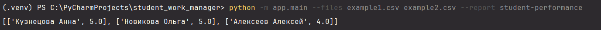
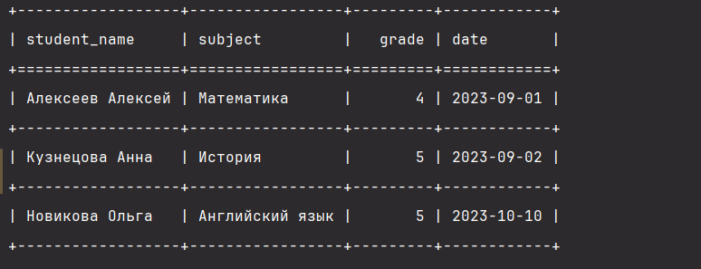

# Система анализа академической успеваемости

---

## Оглавление
1. [Назначение проекта](#назначение-проекта)
2. [Требования к данным](#требования-к-данным)
3. [Инструкция по использованию](#инструкция-по-использованию)
4. [Тестирование и проверка](#тестирование-и-проверка)

---

## Назначение проекта
Данный проект представляет собой инструмент для анализа успеваемости студентов на основе данных, представленных в формате **CSV**. Программа позволяет обрабатывать большие объемы данных, генерировать отчеты и выявлять ключевые тенденции в учебном процессе.

---

## Требования к данным
Для корректной работы скрипта входные файлы должны соответствовать следующему формату:

| ФИО студента       | Предмет         | Оценка | Дата       |
|--------------------|-----------------|--------|------------|
| Кузнецова Анна     | История         | 5      | 02.09.2023 |
| Новикова Ольга     | Английский язык | 5      | 03.09.2023 |
| Алексеев Алексей   | Математика      | 4      | 01.09.2023 |

*Пример структуры данных представлен на скриншотах:*



---

## Инструкция по использованию

### **1. Запуск анализа**
Для запуска анализа используйте следующую команду в терминале:
```bash
python -m app.main --files <путь_к_файлу_1> <путь_к_файлу_2> --report <название_отчета>
